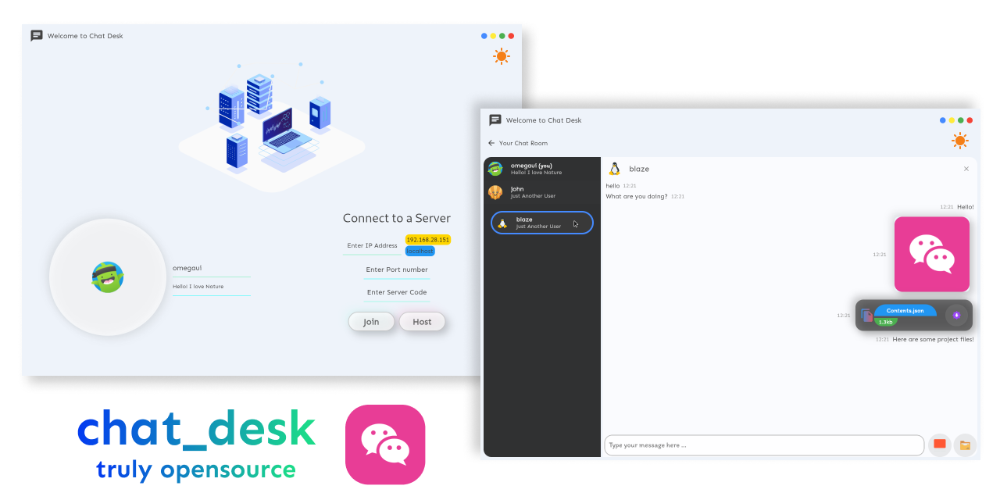

<div align="center" style="margin: 20px;">
    <a href="https://codeclimate.com/github/omegaui/chat_desk/maintainability"></a>
    <a href="https://github.com/omegaui/chat_desk/actions"></a>
    
    
    
</div>

[alpha-preview.webm](https://user-images.githubusercontent.com/73544069/222953852-a379b891-a3f8-4cb9-bb55-848041664768.webm)

#  chat_desk (in the making)
A self-hosted chat application for desktop written in Flutter!

##  Features
- 🚀 Self-Host your own Chat Rooms
- 🔐 Set a Server Code or leave empty for an open connection server
- 💙 Complete Private Chatting
- ❌ No Data Collection
- 🪨 Unbreakable Core
- 🎉 Truly Opensource

##  Features to be implemented
- [ ] 😼 Blocking Users   
- [ ] 💕 An optional white list of users to only allow connection from specified users
- [ ] 🎽 Multi-Theming 

##  Testing (requires dart installed)
###  Linux,  Windows and  MacOS
Head over to **Releases**

####  Build From Source

**It's easy**

- **Clone the repo**
```shell
git clone https://github.com/omegaui/chat_desk
cd chat_desk
```

- Getting Dependencies
```shell
flutter pub get
```

- Launching
```shell
flutter run 
```

<div align="center">
    
    
</div>