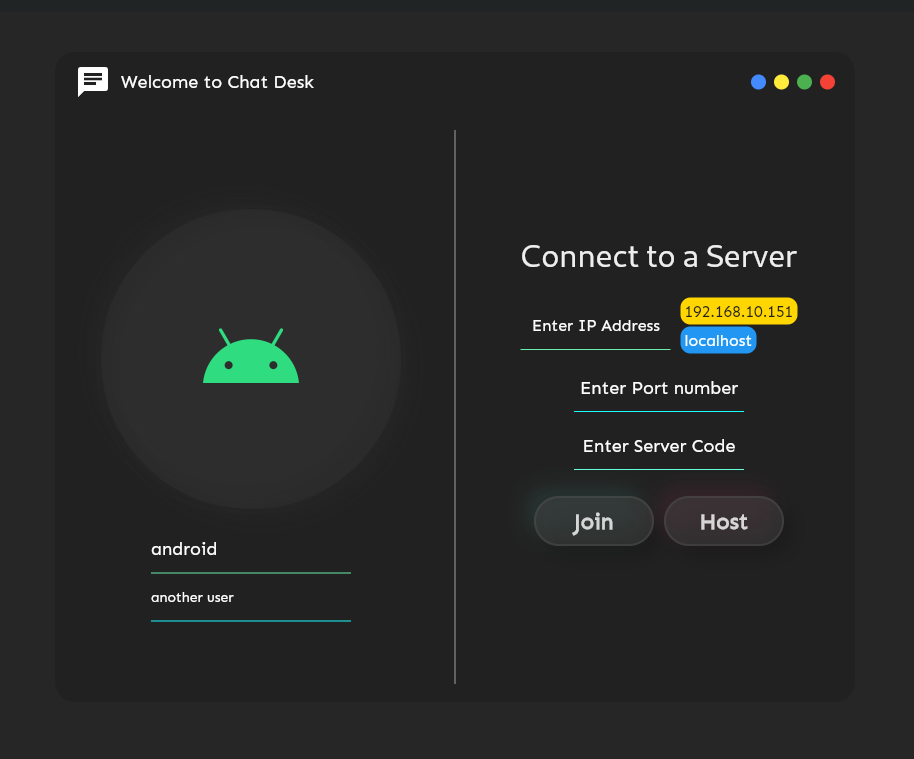
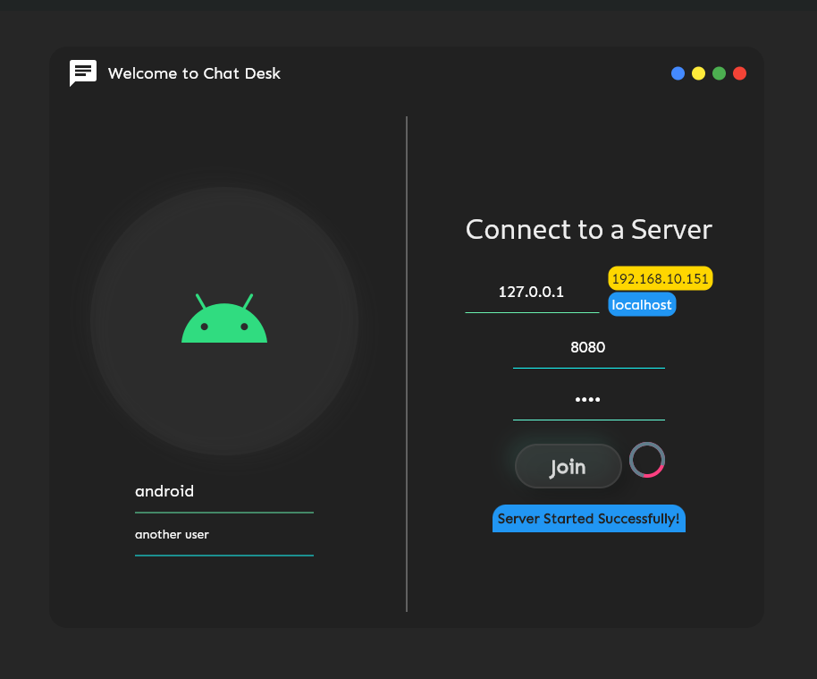
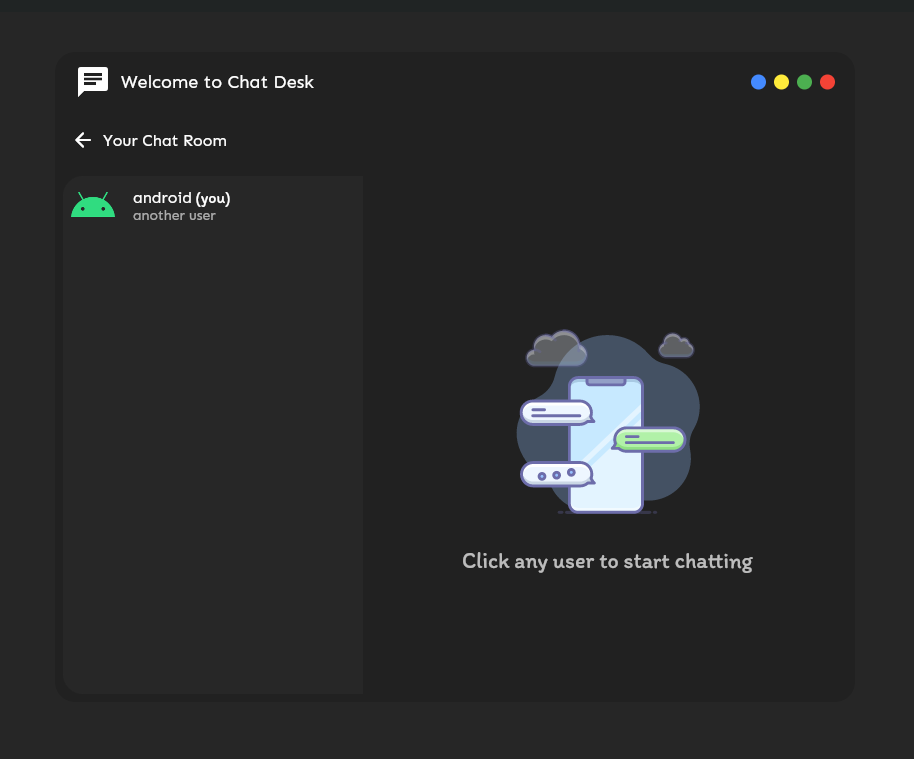
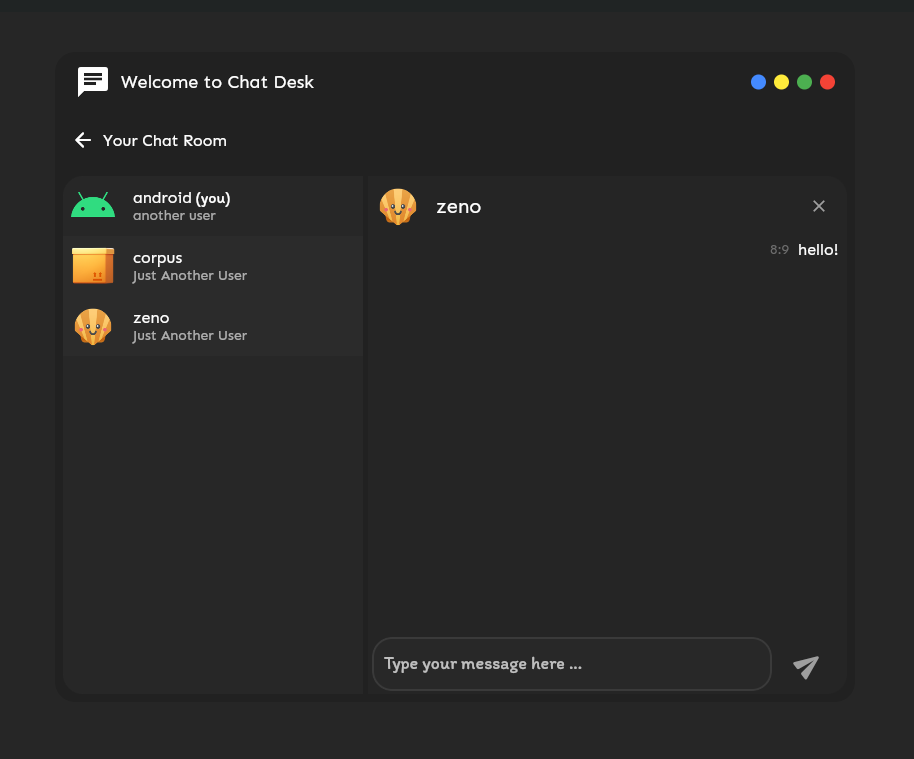

[alpha-preview.webm](https://user-images.githubusercontent.com/73544069/222953852-a379b891-a3f8-4cb9-bb55-848041664768.webm)

# chat_desk (in the making)
A self-hosted chat application for desktop written in Flutter!

## Features
- 🚀 Self-Host your own Chat Rooms
- 🔐 Put your on Server Code or empty for an open connection server
- 💙 Complete Private Chatting
- ❌ No Data Collection
- 🪨 Unbreakable Core
- 🎉 Truly Opensource
## Features to be implemented
- [ ] 😼 Blocking Users   
- [ ] 💕 An optional white list of users to only allow connection from specified users
- [ ] 🎽 Multi-Theming 

